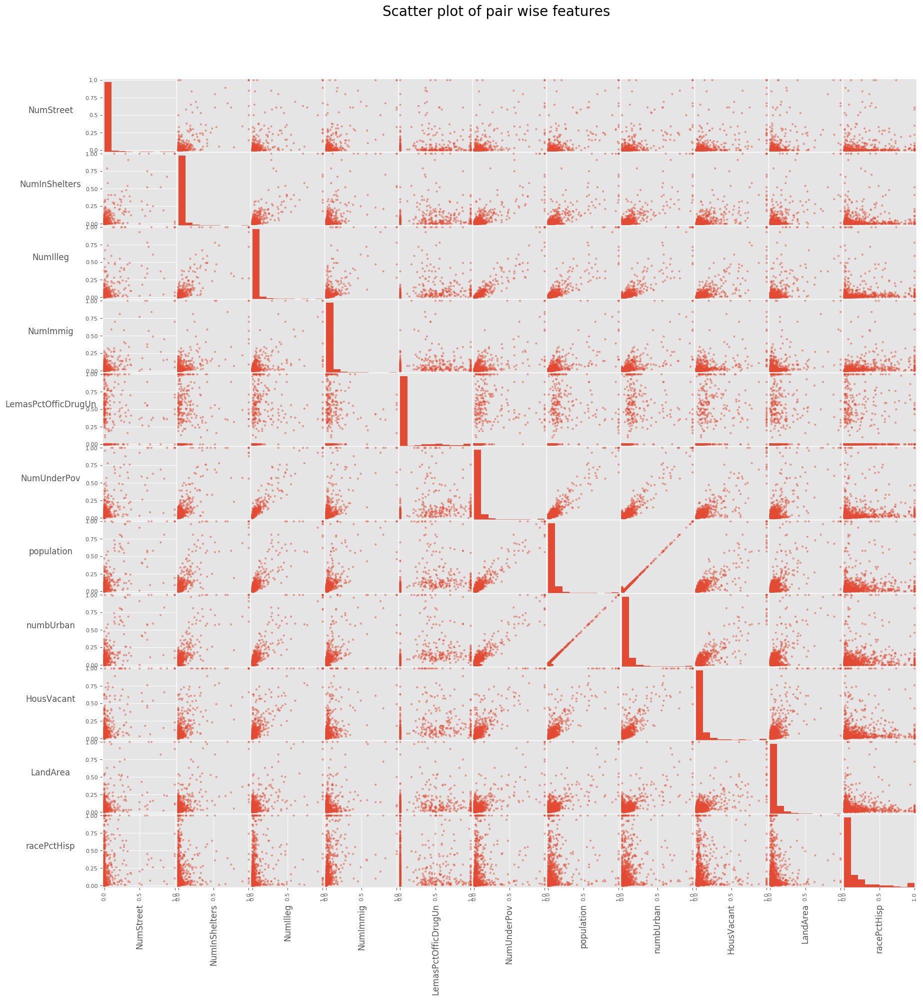
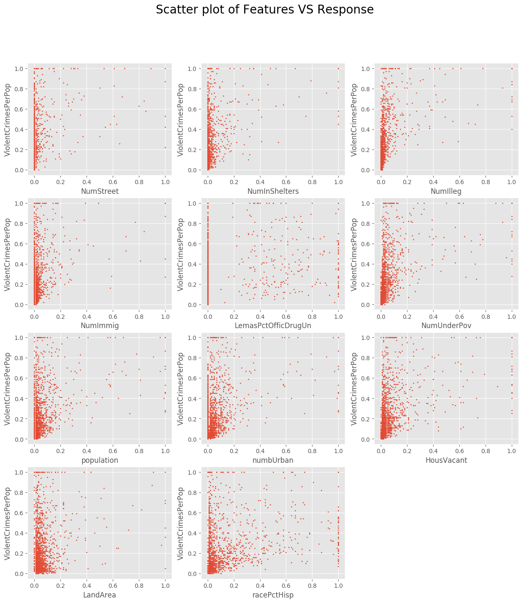
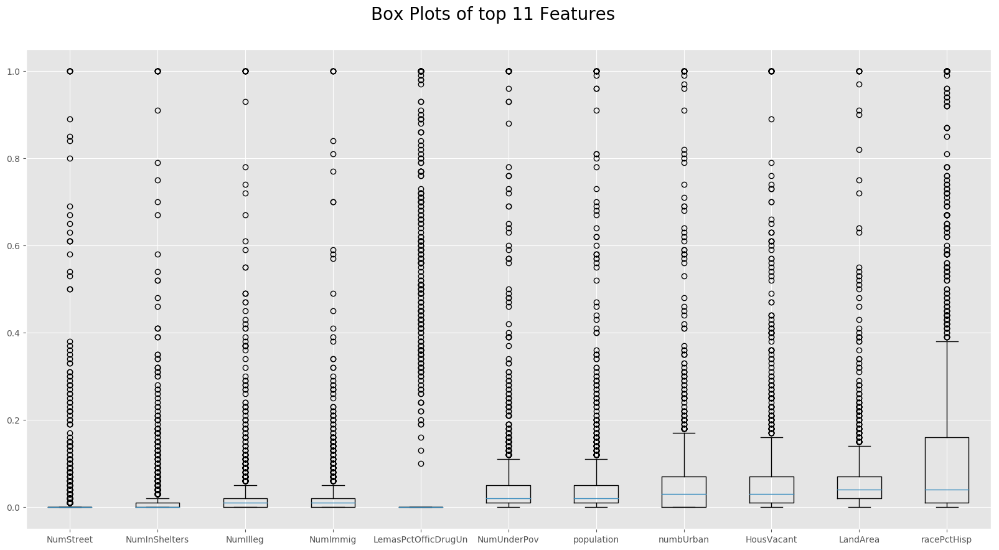
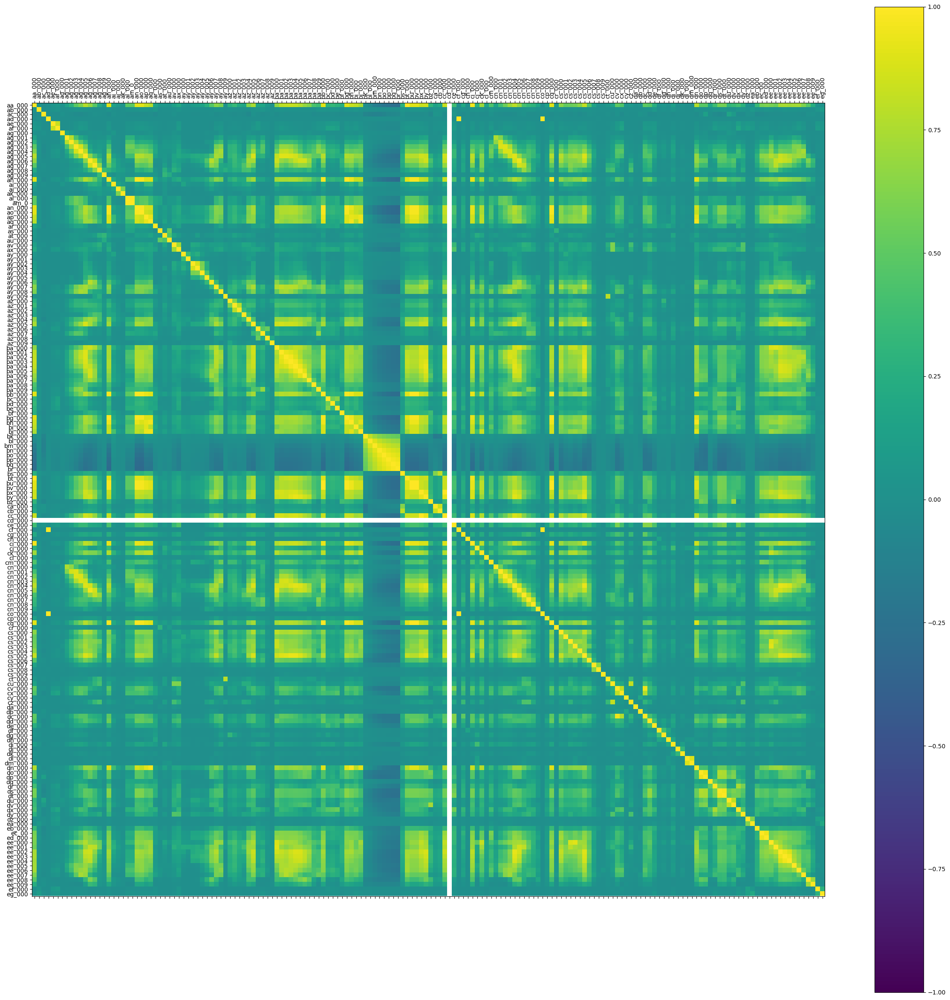
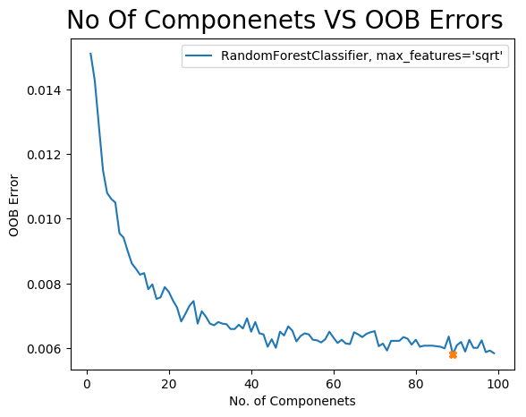
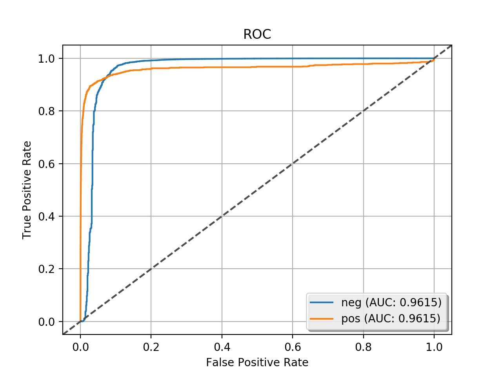

# homework1-kaladharusc ( USC ID: 7761016469 )
## 1) The LASSO and Boosting for Regression
### a) Download and read data
-   Downloaded and read data using pandas
- > Shape 1994 X 128 

    |   | state | county | community | communityname | fold | population | householdsize | racepctblack | racePctWhite | racePctAsian | racePctHisp | agePct12t21 | agePct12t29 | agePct16t24 | agePct65up | numbUrban | pctUrban | medIncome | pctWWage | pctWFarmSelf | pctWInvInc | pctWSocSec | pctWPubAsst | pctWRetire | medFamInc | perCapInc | whitePerCap | blackPerCap | indianPerCap | AsianPerCap | OtherPerCap | HispPerCap | NumUnderPov | PctPopUnderPov | PctLess9thGrade | PctNotHSGrad | PctBSorMore | PctUnemployed | PctEmploy | PctEmplManu | PctEmplProfServ | PctOccupManu | PctOccupMgmtProf | MalePctDivorce | MalePctNevMarr | FemalePctDiv | TotalPctDiv | PersPerFam | PctFam2Par | PctKids2Par | PctYoungKids2Par | PctTeen2Par | PctWorkMomYoungKids | PctWorkMom | NumIlleg | PctIlleg | NumImmig | PctImmigRecent | PctImmigRec5 | PctImmigRec8 | PctImmigRec10 | PctRecentImmig | PctRecImmig5 | PctRecImmig8 | PctRecImmig10 | PctSpeakEnglOnly | PctNotSpeakEnglWell | PctLargHouseFam | PctLargHouseOccup | PersPerOccupHous | PersPerOwnOccHous | PersPerRentOccHous | PctPersOwnOccup | PctPersDenseHous | PctHousLess3BR | MedNumBR | HousVacant | PctHousOccup | PctHousOwnOcc | PctVacantBoarded | PctVacMore6Mos | MedYrHousBuilt | PctHousNoPhone | PctWOFullPlumb | OwnOccLowQuart | OwnOccMedVal | OwnOccHiQuart | RentLowQ | RentMedian | RentHighQ | MedRent | MedRentPctHousInc | MedOwnCostPctInc | MedOwnCostPctIncNoMtg | NumInShelters | NumStreet | PctForeignBorn | PctBornSameState | PctSameHouse85 | PctSameCity85 | PctSameState85 | LemasSwornFT | LemasSwFTPerPop | LemasSwFTFieldOps | LemasSwFTFieldPerPop | LemasTotalReq | LemasTotReqPerPop | PolicReqPerOffic | PolicPerPop | RacialMatchCommPol | PctPolicWhite | PctPolicBlack | PctPolicHisp | PctPolicAsian | PctPolicMinor | OfficAssgnDrugUnits | NumKindsDrugsSeiz | PolicAveOTWorked | LandArea | PopDens | PctUsePubTrans | PolicCars | PolicOperBudg | LemasPctPolicOnPatr | LemasGangUnitDeploy | LemasPctOfficDrugUn | PolicBudgPerPop | ViolentCrimesPerPop |
    |---|-------|--------|-----------|---------------|------|------------|---------------|--------------|--------------|--------------|-------------|-------------|-------------|-------------|------------|-----------|----------|-----------|----------|--------------|------------|------------|-------------|------------|-----------|-----------|-------------|-------------|--------------|-------------|-------------|------------|-------------|----------------|-----------------|--------------|-------------|---------------|-----------|-------------|-----------------|--------------|------------------|----------------|----------------|--------------|-------------|------------|------------|-------------|------------------|-------------|---------------------|------------|----------|----------|----------|----------------|--------------|--------------|---------------|----------------|--------------|--------------|---------------|------------------|---------------------|-----------------|-------------------|------------------|-------------------|--------------------|-----------------|------------------|----------------|----------|------------|--------------|---------------|------------------|----------------|----------------|----------------|----------------|----------------|--------------|---------------|----------|------------|-----------|---------|-------------------|------------------|-----------------------|---------------|-----------|----------------|------------------|----------------|---------------|----------------|--------------|-----------------|-------------------|----------------------|---------------|-------------------|------------------|-------------|--------------------|---------------|---------------|--------------|---------------|---------------|---------------------|-------------------|------------------|----------|---------|----------------|-----------|---------------|---------------------|---------------------|---------------------|-----------------|---------------------|
    | 0 | 8     | ?      | ?         | Lakewoodcity  | 1    | 0.19       | 0.33          | 0.02         | 0.9          | 0.12         | 0.17        | 0.34        | 0.47        | 0.29        | 0.32       | 0.2       | 1.0      | 0.37      | 0.72     | 0.34         | 0.6        | 0.29       | 0.15        | 0.43       | 0.39      | 0.4       | 0.39        | 0.32        | 0.27         | 0.27        | 0.36        | 0.41       | 0.08        | 0.19           | 0.1             | 0.18         | 0.48        | 0.27          | 0.68      | 0.23        | 0.41            | 0.25         | 0.52             | 0.68           | 0.4            | 0.75         | 0.75        | 0.35       | 0.55       | 0.59        | 0.61             | 0.56        | 0.74                | 0.76       | 0.04     | 0.14     | 0.03     | 0.24           | 0.27         | 0.37         | 0.39          | 0.07           | 0.07         | 0.08         | 0.08          | 0.89             | 0.06                | 0.14            | 0.13              | 0.33             | 0.39              | 0.28               | 0.55            | 0.09             | 0.51           | 0.5      | 0.21       | 0.71         | 0.52          | 0.05             | 0.26           | 0.65           | 0.14           | 0.06           | 0.22           | 0.19         | 0.18          | 0.36     | 0.35       | 0.38      | 0.34    | 0.38              | 0.46             | 0.25                  | 0.04          | 0.0       | 0.12           | 0.42             | 0.5            | 0.51          | 0.64           | 0.03         | 0.13            | 0.96              | 0.17                 | 0.06          | 0.18              | 0.44             | 0.13        | 0.94               | 0.93          | 0.03          | 0.07         | 0.1           | 0.07          | 0.02                | 0.57              | 0.29             | 0.12     | 0.26    | 0.2            | 0.06      | 0.04          | 0.9                 | 0.5                 | 0.32                | 0.14            | 0.2                 |
    | 1 | 53    | ?      | ?         | Tukwilacity   | 1    | 0.0        | 0.16          | 0.12         | 0.74         | 0.45         | 0.07        | 0.26        | 0.59        | 0.35        | 0.27       | 0.02      | 1.0      | 0.31      | 0.72     | 0.11         | 0.45       | 0.25       | 0.29        | 0.39       | 0.29      | 0.37      | 0.38        | 0.33        | 0.16         | 0.3         | 0.22        | 0.35       | 0.01        | 0.24           | 0.14            | 0.24         | 0.3         | 0.27          | 0.73      | 0.57        | 0.15            | 0.42         | 0.36             | 1.0            | 0.63           | 0.91         | 1.0         | 0.29       | 0.43       | 0.47        | 0.6              | 0.39        | 0.46                | 0.53       | 0.0      | 0.24     | 0.01     | 0.52           | 0.62         | 0.64         | 0.63          | 0.25           | 0.27         | 0.25         | 0.23          | 0.84             | 0.1                 | 0.16            | 0.1               | 0.17             | 0.29              | 0.17               | 0.26            | 0.2              | 0.82           | 0.0      | 0.02       | 0.79         | 0.24          | 0.02             | 0.25           | 0.65           | 0.16           | 0.0            | 0.21           | 0.2          | 0.21          | 0.42     | 0.38       | 0.4       | 0.37    | 0.29              | 0.32             | 0.18                  | 0.0           | 0.0       | 0.21           | 0.5              | 0.34           | 0.6           | 0.52           | ?            | ?               | ?                 | ?                    | ?             | ?                 | ?                | ?           | ?                  | ?             | ?             | ?            | ?             | ?             | ?                   | ?                 | ?                | 0.02     | 0.12    | 0.45           | ?         | ?             | ?                   | ?                   | 0.0                 | ?               | 0.67                |
    
- > As we can see data has some missing values.

### b) Use Data Imputation Techniques.
-   Filled missing Values with their coresponding column means
- > Shape 1994 X 124 ( removed unpredictors )
     
    |   | fold | population | householdsize | racepctblack | racePctWhite | racePctAsian | racePctHisp | agePct12t21 | agePct12t29 | agePct16t24 | agePct65up | numbUrban | pctUrban | medIncome | pctWWage | pctWFarmSelf | pctWInvInc | pctWSocSec | pctWPubAsst | pctWRetire | medFamInc | perCapInc | whitePerCap | blackPerCap | indianPerCap | AsianPerCap | OtherPerCap | HispPerCap | NumUnderPov | PctPopUnderPov | PctLess9thGrade | PctNotHSGrad | PctBSorMore | PctUnemployed | PctEmploy | PctEmplManu | PctEmplProfServ | PctOccupManu | PctOccupMgmtProf | MalePctDivorce | MalePctNevMarr | FemalePctDiv | TotalPctDiv | PersPerFam | PctFam2Par | PctKids2Par | PctYoungKids2Par | PctTeen2Par | PctWorkMomYoungKids | PctWorkMom | NumIlleg | PctIlleg | NumImmig | PctImmigRecent | PctImmigRec5 | PctImmigRec8 | PctImmigRec10 | PctRecentImmig | PctRecImmig5 | PctRecImmig8 | PctRecImmig10 | PctSpeakEnglOnly | PctNotSpeakEnglWell | PctLargHouseFam | PctLargHouseOccup | PersPerOccupHous | PersPerOwnOccHous | PersPerRentOccHous | PctPersOwnOccup | PctPersDenseHous | PctHousLess3BR | MedNumBR | HousVacant | PctHousOccup | PctHousOwnOcc | PctVacantBoarded | PctVacMore6Mos | MedYrHousBuilt | PctHousNoPhone | PctWOFullPlumb | OwnOccLowQuart | OwnOccMedVal | OwnOccHiQuart | RentLowQ | RentMedian | RentHighQ | MedRent | MedRentPctHousInc | MedOwnCostPctInc | MedOwnCostPctIncNoMtg | NumInShelters | NumStreet | PctForeignBorn | PctBornSameState | PctSameHouse85 | PctSameCity85 | PctSameState85 | LemasSwornFT        | LemasSwFTPerPop     | LemasSwFTFieldOps  | LemasSwFTFieldPerPop | LemasTotalReq       | LemasTotReqPerPop   | PolicReqPerOffic    | PolicPerPop         | RacialMatchCommPol | PctPolicWhite      | PctPolicBlack       | PctPolicHisp        | PctPolicAsian     | PctPolicMinor       | OfficAssgnDrugUnits | NumKindsDrugsSeiz | PolicAveOTWorked  | LandArea | PopDens | PctUsePubTrans | PolicCars           | PolicOperBudg       | LemasPctPolicOnPatr | LemasGangUnitDeploy | LemasPctOfficDrugUn | PolicBudgPerPop    | ViolentCrimesPerPop |
    |---|------|------------|---------------|--------------|--------------|--------------|-------------|-------------|-------------|-------------|------------|-----------|----------|-----------|----------|--------------|------------|------------|-------------|------------|-----------|-----------|-------------|-------------|--------------|-------------|-------------|------------|-------------|----------------|-----------------|--------------|-------------|---------------|-----------|-------------|-----------------|--------------|------------------|----------------|----------------|--------------|-------------|------------|------------|-------------|------------------|-------------|---------------------|------------|----------|----------|----------|----------------|--------------|--------------|---------------|----------------|--------------|--------------|---------------|------------------|---------------------|-----------------|-------------------|------------------|-------------------|--------------------|-----------------|------------------|----------------|----------|------------|--------------|---------------|------------------|----------------|----------------|----------------|----------------|----------------|--------------|---------------|----------|------------|-----------|---------|-------------------|------------------|-----------------------|---------------|-----------|----------------|------------------|----------------|---------------|----------------|---------------------|---------------------|--------------------|----------------------|---------------------|---------------------|---------------------|---------------------|--------------------|--------------------|---------------------|---------------------|-------------------|---------------------|---------------------|-------------------|-------------------|----------|---------|----------------|---------------------|---------------------|---------------------|---------------------|---------------------|--------------------|---------------------|
    | 0 | 1    | 0.19       | 0.33          | 0.02         | 0.9          | 0.12         | 0.17        | 0.34        | 0.47        | 0.29        | 0.32       | 0.2       | 1.0      | 0.37      | 0.72     | 0.34         | 0.6        | 0.29       | 0.15        | 0.43       | 0.39      | 0.4       | 0.39        | 0.32        | 0.27         | 0.27        | 0.36        | 0.41       | 0.08        | 0.19           | 0.1             | 0.18         | 0.48        | 0.27          | 0.68      | 0.23        | 0.41            | 0.25         | 0.52             | 0.68           | 0.4            | 0.75         | 0.75        | 0.35       | 0.55       | 0.59        | 0.61             | 0.56        | 0.74                | 0.76       | 0.04     | 0.14     | 0.03     | 0.24           | 0.27         | 0.37         | 0.39          | 0.07           | 0.07         | 0.08         | 0.08          | 0.89             | 0.06                | 0.14            | 0.13              | 0.33             | 0.39              | 0.28               | 0.55            | 0.09             | 0.51           | 0.5      | 0.21       | 0.71         | 0.52          | 0.05             | 0.26           | 0.65           | 0.14           | 0.06           | 0.22           | 0.19         | 0.18          | 0.36     | 0.35       | 0.38      | 0.34    | 0.38              | 0.46             | 0.25                  | 0.04          | 0.0       | 0.12           | 0.42             | 0.5            | 0.51          | 0.64           | 0.03                | 0.13                | 0.96               | 0.17                 | 0.06                | 0.18                | 0.44                | 0.13                | 0.94               | 0.93               | 0.03                | 0.07                | 0.1               | 0.07                | 0.02                | 0.57              | 0.29              | 0.12     | 0.26    | 0.2            | 0.06                | 0.04                | 0.9                 | 0.5                 | 0.32                | 0.14               | 0.2                 |
    | 1 | 1    | 0.0        | 0.16          | 0.12         | 0.74         | 0.45         | 0.07        | 0.26        | 0.59        | 0.35        | 0.27       | 0.02      | 1.0      | 0.31      | 0.72     | 0.11         | 0.45       | 0.25       | 0.29        | 0.39       | 0.29      | 0.37      | 0.38        | 0.33        | 0.16         | 0.3         | 0.22        | 0.35       | 0.01        | 0.24           | 0.14            | 0.24         | 0.3         | 0.27          | 0.73      | 0.57        | 0.15            | 0.42         | 0.36             | 1.0            | 0.63           | 0.91         | 1.0         | 0.29       | 0.43       | 0.47        | 0.6              | 0.39        | 0.46                | 0.53       | 0.0      | 0.24     | 0.01     | 0.52           | 0.62         | 0.64         | 0.63          | 0.25           | 0.27         | 0.25         | 0.23          | 0.84             | 0.1                 | 0.16            | 0.1               | 0.17             | 0.29              | 0.17               | 0.26            | 0.2              | 0.82           | 0.0      | 0.02       | 0.79         | 0.24          | 0.02             | 0.25           | 0.65           | 0.16           | 0.0            | 0.21           | 0.2          | 0.21          | 0.42     | 0.38       | 0.4       | 0.37    | 0.29              | 0.32             | 0.18                  | 0.0           | 0.0       | 0.21           | 0.5              | 0.34           | 0.6           | 0.52           | 0.06965517241379311 | 0.21746081504702197 | 0.9247335423197492 | 0.2463322884012539   | 0.09799373040752352 | 0.21520376175548586 | 0.34363636363636363 | 0.21749216300940438 | 0.6894043887147336 | 0.7269592476489029 | 0.22047021943573672 | 0.13485893416927902 | 0.114858934169279 | 0.25918495297805644 | 0.0755485893416928  | 0.556050156739812 | 0.305987460815047 | 0.02     | 0.12    | 0.45           | 0.16310344827586207 | 0.07670846394984326 | 0.69858934169279    | 0.44043887147335425 | 0.0                 | 0.1950783699059561 | 0.67                |
- > We can see there are no missing values

### c) Correlation Matrix
-   

### d) Coefficient of Variation for each feature.
-   Calculated using `Standard Deviation / Mean` .

    | Feature               | Coefficient Of Variation |
    |-----------------------|--------------------------|
    | NumStreet             | 4.292922989491593        |
    | NumInShelters         | 3.470952139705214        |
    | NumIlleg              | 3.0589643472092356       |
    | NumImmig              | 2.9266352462888148       |
    | LemasPctOfficDrugUn   | 2.552945511727576        |
    | NumUnderPov           | 2.3424431162181505       |
    | population            | 2.2411046245803745       |
    | numbUrban             | 2.0384614919156445       |
    | HousVacant            | 1.9684670491351257       |
    | LandArea              | 1.6454078602149063       |
    | racePctHisp           | 1.612091005228411        |
    | PctNotSpeakEnglWell   | 1.4566183675039828       |
    | racepctblack          | 1.4288854186502822       |
    | PctUsePubTrans        | 1.3971097612127603       |
    | racePctAsian          | 1.359099684159002        |
    | PctRecentImmig        | 1.288286991787815        |
    | PctRecImmig5          | 1.286184069121448        |
    | PctRecImmig10         | 1.2704761039803925       |
    | PctRecImmig8          | 1.2655788622333226       |
    | PctPersDenseHous      | 1.1329256518367359       |
    | PctForeignBorn        | 1.0658797341302004       |
    | PctVacantBoarded      | 1.0548273380808388       |
    | ViolentCrimesPerPop   | 0.9879088645521366       |
    | PctHousNoPhone        | 0.9227647590220344       |
    | PctIlleg              | 0.9215499866941839       |
    | OwnOccMedVal          | 0.889409997564829        |
    | OwnOccHiQuart         | 0.8835825993723008       |
    | LemasSwornFT          | 0.8722529356778985       |
    | PopDens               | 0.8644992034803372       |
    | OwnOccLowQuart        | 0.8595655789242966       |
    | PctWOFullPlumb        | 0.8432062676593917       |
    | indianPerCap          | 0.8183681264327733       |
    | MedNumBR              | 0.8139470895341551       |
    | PolicOperBudg         | 0.7743443211261958       |
    | PctLargHouseOccup     | 0.7631976222314811       |
    | PctPopUnderPov        | 0.754469978085357        |
    | PctLargHouseFam       | 0.7386915454231807       |
    | PctPolicAsian         | 0.7262293163276773       |
    | pctWPubAsst           | 0.7062058943769388       |
    | pctWFarmSelf          | 0.701897873082006        |
    | LemasTotalReq         | 0.6975275179267774       |
    | OfficAssgnDrugUnits   | 0.6888091316674114       |
    | PctImmigRecent        | 0.6814864307426184       |
    | PctLess9thGrade       | 0.6804903296377428       |
    | OtherPerCap           | 0.6732169975302158       |
    | pctUrban              | 0.6433181716461008       |
    | RentLowQ              | 0.6396616452190297       |
    | AsianPerCap           | 0.6148655265869314       |
    | blackPerCap           | 0.5993405451897994       |
    | PctPolicHisp          | 0.5949533571476963       |
    | RentHighQ             | 0.5940594809708987       |
    | PctBSorMore           | 0.5926798349812531       |
    | medIncome             | 0.5919781653450651       |
    | PctImmigRec5          | 0.5907934182085816       |
    | RentMedian            | 0.5687776924869173       |
    | MedRent               | 0.5634425038390524       |
    | PctUnemployed         | 0.562424698851533        |
    | perCapInc             | 0.5580794526579645       |
    | medFamInc             | 0.5406701530549352       |
    | PolicCars             | 0.5398226917021794       |
    | PctNotHSGrad          | 0.5337533808931807       |
    | whitePerCap           | 0.519828467024789        |
    | PctOccupManu          | 0.5163793587769291       |
    | PctEmplManu           | 0.5135297542547989       |
    | fold                  | 0.510302111015002        |
    | PctImmigRec8          | 0.5050721810572517       |
    | agePct16t24           | 0.5003099115377213       |
    | HispPerCap            | 0.4840679504501606       |
    | PersPerRentOccHous    | 0.4736550685710704       |
    | MedYrHousBuilt        | 0.470762074441811        |
    | MedOwnCostPctIncNoMtg | 0.4702069718356742       |
    | PctImmigRec10         | 0.4577484543862395       |
    | PctPolicBlack         | 0.4472186954207617       |
    | PctVacMore6Mos        | 0.43808176451988246      |
    | PctOccupMgmtProf      | 0.43266953598425273      |
    | MedOwnCostPctInc      | 0.41550160572977074      |
    | agePct65up            | 0.4127759758512281       |
    | MalePctNevMarr        | 0.40406152224265024      |
    | PctEmplProfServ       | 0.40284884867313686      |
    | MalePctDivorce        | 0.3993660859242948       |
    | TotalPctDiv           | 0.37390450168497985      |
    | LemasGangUnitDeploy   | 0.3710015895528759       |
    | agePct12t21           | 0.3690831192095117       |
    | PersPerOccupHous      | 0.3672534015041071       |
    | pctWInvInc            | 0.365334582744191        |
    | pctWSocSec            | 0.36071544651696696      |
    | FemalePctDiv          | 0.3603898277589537       |
    | PctPolicMinor         | 0.356241433781327        |
    | householdsize         | 0.3557995664028941       |
    | PctEmploy             | 0.3514504046780556       |
    | PctPersOwnOccup       | 0.34920959278252445      |
    | pctWRetire            | 0.3454209567630026       |
    | PctHousLess3BR        | 0.34355333525689935      |
    | MedRentPctHousInc     | 0.34306486918919427      |
    | PctWorkMomYoungKids   | 0.3406809390881452       |
    | PctBornSameState      | 0.33624489274009706      |
    | PctHousOwnOcc         | 0.33612858762074044      |
    | PctWorkMom            | 0.3360178908039217       |
    | PctKids2Par           | 0.33487556916187433      |
    | PctSameHouse85        | 0.33451877905492433      |
    | PctYoungKids2Par      | 0.3338334680337065       |
    | PctFam2Par            | 0.3331946554395547       |
    | racePctWhite          | 0.3302126634442826       |
    | pctWWage              | 0.3286140569015946       |
    | PctTeen2Par           | 0.3278008334193768       |
    | PolicBudgPerPop       | 0.32003502145419926      |
    | PersPerOwnOccHous     | 0.3192144507431373       |
    | PctSameCity85         | 0.31875804915193473      |
    | PersPerFam            | 0.31737540470857095      |
    | LemasTotReqPerPop     | 0.3094225266056299       |
    | PolicAveOTWorked      | 0.30888779112006637      |
    | PctSameState85        | 0.2984340732673321       |
    | agePct12t29           | 0.2913148106352062       |
    | PctSpeakEnglOnly      | 0.28999867240218546      |
    | LemasSwFTPerPop       | 0.28843327513706196      |
    | PolicPerPop           | 0.2883990936086546       |
    | PctHousOccup          | 0.2681815038662207       |
    | LemasSwFTFieldPerPop  | 0.24500189758872482      |
    | PolicReqPerOffic      | 0.2263593215884439       |
    | NumKindsDrugsSeiz     | 0.14353283569192646      |
    | RacialMatchCommPol    | 0.13373712221130316      |
    | PctPolicWhite         | 0.12258236559333853      |
    | LemasPctPolicOnPatr   | 0.11798844847958818      |
    | LemasSwFTFieldOps     | 0.06400225509556129      |
    
### e) Scatter plot and Box plots
-   
-   
-   
-   ~TODO: Conclusions~

### f) Linear Regression:

   > **Test Mean Squared Error: 0.7716253161613343**

### g) Ridge Regression:

   > **Lambda : 1.0**  
   > **Test Mean Squared Error : 0.0177**
   
### h) Lasso:

-   ##### Without Normalization:

       > **Lambda : 0.001**  
       > **Test Mean Squared Error: 0.0175493**
       
    -   List of Selected Features

        | Feature               | Coefficeint             |
        |-----------------------|-------------------------|
        | fold                  | -0.0024632818940134847  |
        | racepctblack          | 0.2136304826238652      |
        | racePctWhite          | -0.010666196061505265   |
        | agePct12t29           | -0.0056684065166765695  |
        | pctUrban              | 0.0387977055910673      |
        | pctWPubAsst           | 0.031154908251889758    |
        | pctWRetire            | -0.00034365605499309305 |
        | AsianPerCap           | 0.010628869535947045    |
        | MalePctDivorce        | 0.14738919568761458     |
        | PctKids2Par           | -0.21068845158371485    |
        | PctYoungKids2Par      | -0.0047671145061663825  |
        | PctWorkMom            | -0.049508602937231166   |
        | PctIlleg              | 0.15733045885348862     |
        | PctRecImmig10         | 0.0030141250238833175   |
        | PctPersDenseHous      | 0.15647494687113706     |
        | HousVacant            | 0.10157965991303455     |
        | PctHousOccup          | -0.045633926812455955   |
        | PctVacantBoarded      | 0.035451356270784926    |
        | MedRentPctHousInc     | 0.023800255539232602    |
        | MedOwnCostPctIncNoMtg | -0.016075361511763562   |
        | NumStreet             | 0.07763144804534455     |
        | PctForeignBorn        | 0.04160212014119507     |
        | LemasGangUnitDeploy   | 0.01303154622439256     |
        | LemasPctOfficDrugUn   | 0.004976531468026911    |

-   #####  After Normalization:

       > **Lambda : 0.001**   
        **Test Mean Squared Error : 0.0197735**
        
    -   List of Selected Features

        | Feature      | Coefficient          |
        |--------------|----------------------|
        | racePctWhite | -0.16657586983235712 |
        | PctKids2Par  | -0.34683223005634045 |
        | PctIlleg     | 0.1645701922221338   |
        | HousVacant   | 0.06341717198318916  |

### i) PCR Model:

   > **Test Mean Squared Error : 0.0197735**
   
   
### j) XG BOOST:

   > **Alpha : 0.10**
    -   
    
## 2) Tree Based Methods

### b) Data Preparation

-   ####  i) Impute Data
   > Train Data Shape : 60000 X 171 

|   | class | aa_000 | ab_000             | ac_000       | ad_000            | ae_000 | af_000 | ag_000 | ag_001 | ag_002 | ag_003 | ag_004  | ag_005    | ag_006    | ag_007    | ag_008  | ag_009 | ah_000    | ai_000 | aj_000 | ak_000 | al_000 | am_0 | an_000    | ao_000    | ap_000    | aq_000    | ar_000 | as_000 | at_000 | au_000 | av_000 | ax_000 | ay_000 | ay_001 | ay_002 | ay_003 | ay_004 | ay_005   | ay_006    | ay_007    | ay_008   | ay_009 | az_000 | az_001 | az_002  | az_003  | az_004    | az_005    | az_006  | az_007 | az_008 | az_009 | ba_000    | ba_001    | ba_002   | ba_003   | ba_004   | ba_005   | ba_006    | ba_007   | ba_008  | ba_009 | bb_000    | bc_000 | bd_000 | be_000 | bf_000 | bg_000    | bh_000  | bi_000   | bj_000   | bk_000   | bl_000   | bm_000   | bn_000            | bo_000             | bp_000            | bq_000            | br_000            | bs_000   | bt_000   | bu_000    | bv_000    | bx_000    | by_000  | bz_000   | ca_000   | cb_000   | cc_000    | cd_000    | ce_000   | cf_000            | cg_000            | ch_000                 | ci_000     | cj_000 | ck_000    | cl_000 | cm_000 | cn_000 | cn_001 | cn_002 | cn_003   | cn_004    | cn_005    | cn_006    | cn_007  | cn_008  | cn_009 | co_000             | cp_000 | cq_000    | cr_000            | cs_000  | cs_001 | cs_002   | cs_003   | cs_004   | cs_005    | cs_006   | cs_007  | cs_008 | cs_009 | ct_000            | cu_000             | cv_000             | cx_000             | cy_000             | cz_000             | da_000            | db_000           | dc_000            | dd_000 | de_000 | df_000 | dg_000 | dh_000 | di_000 | dj_000 | dk_000 | dl_000 | dm_000 | dn_000  | do_000  | dp_000  | dq_000 | dr_000 | ds_000   | dt_000  | du_000     | dv_000    | dx_000 | dy_000 | dz_000 | ea_000 | eb_000    | ec_00   | ed_000 | ee_000   | ee_001    | ee_002    | ee_003   | ee_004   | ee_005   | ee_006   | ee_007   | ee_008  | ee_009 | ef_000 | eg_000 |
|---|-------|--------|--------------------|--------------|-------------------|--------|--------|--------|--------|--------|--------|---------|-----------|-----------|-----------|---------|--------|-----------|--------|--------|--------|--------|------|-----------|-----------|-----------|-----------|--------|--------|--------|--------|--------|--------|--------|--------|--------|--------|--------|----------|-----------|-----------|----------|--------|--------|--------|---------|---------|-----------|-----------|---------|--------|--------|--------|-----------|-----------|----------|----------|----------|----------|-----------|----------|---------|--------|-----------|--------|--------|--------|--------|-----------|---------|----------|----------|----------|----------|----------|-------------------|--------------------|-------------------|-------------------|-------------------|----------|----------|-----------|-----------|-----------|---------|----------|----------|----------|-----------|-----------|----------|-------------------|-------------------|------------------------|------------|--------|-----------|--------|--------|--------|--------|--------|----------|-----------|-----------|-----------|---------|---------|--------|--------------------|--------|-----------|-------------------|---------|--------|----------|----------|----------|-----------|----------|---------|--------|--------|-------------------|--------------------|--------------------|--------------------|--------------------|--------------------|-------------------|------------------|-------------------|--------|--------|--------|--------|--------|--------|--------|--------|--------|--------|---------|---------|---------|--------|--------|----------|---------|------------|-----------|--------|--------|--------|--------|-----------|---------|--------|----------|-----------|-----------|----------|----------|----------|----------|----------|---------|--------|--------|--------|
| 0 | neg   | 76698  | 0.7131885012069343 | 2130706438.0 | 280.0             | 0.0    | 0.0    | 0.0    | 0.0    | 0.0    | 0.0    | 37250.0 | 1432864.0 | 3664156.0 | 1007684.0 | 25896.0 | 0.0    | 2551696.0 | 0.0    | 0.0    | 0.0    | 0.0    | 0.0  | 4933296.0 | 3655166.0 | 1766008.0 | 1132040.0 | 0.0    | 0.0    | 0.0    | 0.0    | 1012.0 | 268.0  | 0.0    | 0.0    | 0.0    | 0.0    | 0.0    | 469014.0 | 4239660.0 | 703300.0  | 755876.0 | 0.0    | 5374.0 | 2108.0 | 4114.0  | 12348.0 | 615248.0  | 5526276.0 | 2378.0  | 4.0    | 0.0    | 0.0    | 2328746.0 | 1022304.0 | 415432.0 | 287230.0 | 310246.0 | 681504.0 | 1118814.0 | 3574.0   | 0.0     | 0.0    | 6700214.0 | 0.0    | 10.0   | 108.0  | 50.0   | 2551696.0 | 97518.0 | 947550.0 | 799478.0 | 330760.0 | 353400.0 | 299160.0 | 305200.0          | 283680.0           | 551389.7993474714 | 582871.3229295975 | 604886.6132637854 | 178540.0 | 76698.08 | 6700214.0 | 6700214.0 | 6599892.0 | 43566.0 | 68656.0  | 54064.0  | 638360.0 | 6167850.0 | 1209600.0 | 246244.0 | 2.0               | 96.0              | 0.0                    | 5245752.0  | 0.0    | 916567.68 | 6.0    | 1924.0 | 0.0    | 0.0    | 0.0    | 118196.0 | 1309472.0 | 3247182.0 | 1381362.0 | 98822.0 | 11208.0 | 1608.0 | 220.0              | 240.0  | 6700214.0 | 37.06298003072197 | 10476.0 | 1226.0 | 267998.0 | 521832.0 | 428776.0 | 4015854.0 | 895240.0 | 26330.0 | 118.0  | 0.0    | 532.0             | 734.0              | 4122704.0          | 51288.0            | 0.0                | 532572.0           | 0.0               | 18.0             | 5330690.0         | 4732.0 | 1126.0 | 0.0    | 0.0    | 0.0    | 0.0    | 0.0    | 0.0    | 0.0    | 0.0    | 62282.0 | 85908.0 | 32790.0 | 0.0    | 0.0    | 202710.0 | 37928.0 | 14745580.0 | 1876644.0 | 0.0    | 0.0    | 0.0    | 0.0    | 2801180.0 | 2445.8  | 2712.0 | 965866.0 | 1706908.0 | 1240520.0 | 493384.0 | 721044.0 | 469792.0 | 339156.0 | 157956.0 | 73224.0 | 0.0    | 0.0    | 0.0    |
| 1 | neg   | 33058  | 0.7131885012069343 | 0.0          | 190620.6393141186 | 0.0    | 0.0    | 0.0    | 0.0    | 0.0    | 0.0    | 18254.0 | 653294.0  | 1720800.0 | 516724.0  | 31642.0 | 0.0    | 1393352.0 | 0.0    | 68.0   | 0.0    | 0.0    | 0.0  | 2560898.0 | 2127150.0 | 1084598.0 | 338544.0  | 0.0    | 0.0    | 0.0    | 0.0    | 0.0    | 0.0    | 0.0    | 0.0    | 0.0    | 0.0    | 0.0    | 71510.0  | 772720.0  | 1996924.0 | 99560.0  | 0.0    | 7336.0 | 7808.0 | 13776.0 | 13086.0 | 1010074.0 | 1873902.0 | 14726.0 | 6.0    | 0.0    | 0.0    | 1378576.0 | 447166.0  | 199512.0 | 154298.0 | 137280.0 | 138668.0 | 165908.0  | 229652.0 | 87082.0 | 4708.0 | 3646660.0 | 86.0   | 454.0  | 364.0  | 350.0  | 1393352.0 | 49028.0 | 688314.0 | 392208.0 | 341420.0 | 359780.0 | 366560.0 | 463710.8335938966 | 513147.82029706595 | 551389.7993474714 | 582871.3229295975 | 604886.6132637854 | 6700.0   | 33057.51 | 3646660.0 | 3646660.0 | 3582034.0 | 17733.0 | 260120.0 | 115626.0 | 6900.0   | 2942850.0 | 1209600.0 | 0.0      | 190221.8109838499 | 91.52041471897915 | 0.00044307583242872016 | 2291079.36 | 0.0    | 643536.96 | 0.0    | 0.0    | 0.0    | 0.0    | 38.0   | 98644.0  | 1179502.0 | 1286736.0 | 336388.0  | 36294.0 | 5192.0  | 56.0   | 190515.56693768137 | 0.0    | 3646660.0 | 37.06298003072197 | 6160.0  | 796.0  | 164860.0 | 350066.0 | 272956.0 | 1837600.0 | 301242.0 | 9148.0  | 22.0   | 0.0    | 749.0912712157949 | 1222.9609889158296 | 1928824.8933581572 | 351510.23623138206 | 274.17933841357814 | 19374.290483200555 | 7.393791132663664 | 13.4166522341531 | 2200752.208997229 | 3312.0 | 522.0  | 0.0    | 0.0    | 0.0    | 0.0    | 0.0    | 0.0    | 0.0    | 0.0    | 33736.0 | 36946.0 | 5936.0  | 0.0    | 0.0    | 103330.0 | 16254.0 | 4510080.0  | 868538.0  | 0.0    | 0.0    | 0.0    | 0.0    | 3477820.0 | 2211.76 | 2334.0 | 664504.0 | 824154.0  | 421400.0  | 178064.0 | 293306.0 | 245416.0 | 133654.0 | 81140.0  | 97576.0 | 1500.0 | 0.0    | 0.0    |

-   ####  ii) Coefficent Of Variation

| Features | Coefficeint Of Variation |
|----------|--------------------------|
| cs_009   | 235.27760461029902       |
| cf_000   | 184.23309219117692       |
| co_000   | 183.94901745596403       |
| ad_000   | 183.84762036900082       |
| dh_000   | 114.98499085012163       |
| dj_000   | 109.6472849388733        |
| ag_000   | 91.87856462936738        |
| as_000   | 86.41690384051536        |
| ay_009   | 83.78606300858695        |
| az_009   | 76.96797806358856        |
| ak_000   | 74.5266879586007         |
| au_000   | 68.1605540126918         |
| ch_000   | 58.268228662292024       |
| ay_001   | 52.23385176360165        |
| dz_000   | 49.00215810098666        |
| df_000   | 48.79901491451668        |
| cs_008   | 47.68230960735955        |
| ef_000   | 47.124953091672005       |
| aj_000   | 43.80182238271878        |
| eg_000   | 40.55324999114492        |
| ay_002   | 38.809580401918666       |
| dl_000   | 37.08367624939188        |
| ay_000   | 37.009562327062504       |
| dg_000   | 35.914418426339644       |
| ag_001   | 34.854950077721575       |
| dk_000   | 34.564625419181496       |
| cn_009   | 33.88067479556715        |
| dm_000   | 33.83761582350898        |
| ay_004   | 33.37471600468463        |
| ea_000   | 33.35988009366405        |
| ag_009   | 32.98435104133622        |
| ay_003   | 28.413541533699558       |
| cy_000   | 28.17467509343771        |
| cn_000   | 26.033814628328138       |
| at_000   | 23.4594247908152         |
| ae_000   | 23.190936665578853       |
| da_000   | 22.605161184632596       |
| az_008   | 22.425769593584352       |
| dq_000   | 21.028170847144775       |
| af_000   | 18.658921096017636       |
| ai_000   | 18.01268174446153        |
| ag_002   | 17.369143404889634       |
| az_007   | 16.0475831066938         |
| cp_000   | 13.314694485610156       |
| cr_000   | 13.22643929894233        |
| az_002   | 13.141692934269287       |
| cl_000   | 12.581821193680259       |
| ay_005   | 12.384140755927538       |
| cz_000   | 11.194424576584552       |
| cn_001   | 11.133096187166533       |
| di_000   | 11.033810823646995       |
| cj_000   | 11.006918645639892       |
| ar_000   | 10.837049702204823       |
| cn_008   | 9.632407233107722        |
| az_000   | 9.328344486184422        |
| ba_009   | 9.321499969159309        |
| al_000   | 9.074370822656968        |
| am_0     | 9.058671606113235        |
| az_006   | 8.780911858826425        |
| ag_003   | 8.550049026704684        |
| az_001   | 7.646419521779571        |
| az_003   | 7.445975842745191        |
| dy_000   | 7.439768405932975        |
| bf_000   | 7.148627136082608        |
| bc_000   | 6.9408376319653735       |
| ba_008   | 6.751545328357267        |
| cn_002   | 6.62974954038145         |
| be_000   | 6.596703826826659        |
| dr_000   | 6.550215985949696        |
| ct_000   | 6.5428841622998535       |
| cn_007   | 6.2727131158680995       |
| ag_008   | 6.1545830785515525       |
| bz_000   | 6.0265871102162025       |
| av_000   | 5.778784910088061        |
| ee_009   | 5.626978573387686        |
| cu_000   | 5.4766428237794          |
| ag_004   | 5.401478695421808        |
| cs_007   | 5.38903432575705         |
| dx_000   | 5.126012141533043        |
| bd_000   | 5.122673787282317        |
| cs_002   | 5.0615095570619975       |
| ee_007   | 4.96248265473225         |
| db_000   | 4.8005585196162075       |
| cs_004   | 4.64252696283168         |
| cm_000   | 4.5109505987678356       |
| de_000   | 4.399005873743279        |
| eb_000   | 4.249694190666425        |
| cn_003   | 4.14612862867182         |
| ax_000   | 3.87756833864513         |
| cx_000   | 3.7760983799839964       |
| ay_008   | 3.775647501365842        |
| cs_001   | 3.6404130761180413       |
| bj_000   | 3.5506514138575445       |
| cg_000   | 3.522690845716377        |
| dv_000   | 3.4270936102602794       |
| ay_007   | 3.284242057456218        |
| ee_000   | 3.2759793421988075       |
| ee_001   | 3.260341713745137        |
| ee_008   | 3.2220102366275203       |
| ee_006   | 3.192127605204078        |
| cn_006   | 3.1341690731237724       |
| cs_003   | 3.1087118811150107       |
| ap_000   | 3.059164306638844        |
| ck_000   | 3.0441455759197638       |
| ay_006   | 3.0230876409551373       |
| az_005   | 3.008074496977547        |
| ba_006   | 3.0072727046907652       |
| bi_000   | 3.0025475156084687       |
| dd_000   | 2.9821282892523966       |
| ag_005   | 2.9270920824257813       |
| ba_002   | 2.87875570358961         |
| dn_000   | 2.86779527568967         |
| aq_000   | 2.839611693365452        |
| ag_007   | 2.8334840909357935       |
| ee_005   | 2.829721866351814        |
| az_004   | 2.817140133262502        |
| ba_007   | 2.810368601338902        |
| du_000   | 2.7846105634562752       |
| ba_003   | 2.71611603859956         |
| ba_000   | 2.683076483037055        |
| ba_005   | 2.679875760346078        |
| ba_004   | 2.6160211060050433       |
| bh_000   | 2.6127846804601473       |
| ba_001   | 2.6087317029064665       |
| ee_004   | 2.6064016497162035       |
| cn_004   | 2.6020322394479853       |
| ee_002   | 2.5793190729643185       |
| ee_003   | 2.5589980471030502       |
| cs_005   | 2.4971790951243853       |
| cc_000   | 2.4611725391760646       |
| aa_000   | 2.450937577943998        |
| bx_000   | 2.4479868200261623       |
| bt_000   | 2.4445039541485576       |
| by_000   | 2.441315586541716        |
| ci_000   | 2.3935475058866          |
| bb_000   | 2.3923193632170467       |
| bu_000   | 2.391231519139085        |
| bv_000   | 2.391231356078575        |
| cq_000   | 2.3912313225097015       |
| ec_00    | 2.380228835988021        |
| ag_006   | 2.3449270703375973       |
| cn_005   | 2.331444431651778        |
| ab_000   | 2.3283999870318435       |
| ah_000   | 2.3001872486143227       |
| bg_000   | 2.297835741090436        |
| ds_000   | 2.2688657333506534       |
| ao_000   | 2.260149116812668        |
| an_000   | 2.2387967743803063       |
| ed_000   | 2.2258247899687995       |
| ce_000   | 2.173283960953867        |
| ac_000   | 2.169766523276966        |
| dt_000   | 2.143945284322684        |
| cs_006   | 2.1284775523174093       |
| do_000   | 2.0993554539547485       |
| dp_000   | 1.9593936554528664       |
| cs_000   | 1.8716391711568066       |
| cv_000   | 1.6653358073482392       |
| dc_000   | 1.6386763639093962       |
| bs_000   | 1.0452876409160188       |
| cb_000   | 0.9051051395882678       |
| ca_000   | 0.9035040103969598       |
| bl_000   | 0.73357150175634         |
| bk_000   | 0.731378375865354        |
| bm_000   | 0.5947258220906063       |
| bn_000   | 0.5170606228668952       |
| bo_000   | 0.46256369320133955      |
| bp_000   | 0.4259665526645465       |
| bq_000   | 0.3991915010746177       |
| br_000   | 0.38266897631364816      |
| cd_000   | 0.0                      |

-   ####  iii) Correlation Matrix

   

-   ### iv) Scatter plots and box plots
   
   
-   ### v) Number of neg and pos
    >   neg    59000   
        pos     1000
### C) Random Forest: imbalanced
   - Train Confusion Matrix
   
   - Test Confusion Matrix
   
   - Train ROC and AUC
   
   - Test ROC and AUC
   
   
   > Train Accuracy :   0.9999833333    
   > Test Accuracy: 0.9925
   > Train Mis Classification Rate: 0.00001
   > Test Mis Classification Rate: 0.0075
   
   
   > OOB ERROR: 0.005   
   > No. Of Components: 92

### D) Random Forest: Balanced
   - Train Confusion Matrix 
   
   - Test Confusion Matrix
   
   - Train ROC
   
   - Test ROC
   

   > Train Accuracy :   0.99975       
   > Test Accuracy: 0.98875   
   > Train Mis Classification Rate: 0.00025   
   > Test Mis Classification Rate: 0.01125
   - OOB ERRORS
   
   > No.Of Componenets : 80   
   > OOB ERROR: 0.005   
   
### E) Model Trees
   Used 5 Folds
   - Train ROC
   
   
   - Test ROC
   
   -    Test Confusion Matrix
        
   - Train confusion matrix
        
   > Train Accuracy: 99.17333333333333
   > Test Accuracy: 99.025

### F) SMOTE

   - Trained using 10k Train data and 5 folds
   
   
   - Test ROC 
      

   - Test Confusion Matrix
       
   - Train Confusion Matrix with 10k values oversampled to (~20k) using smote  
       
       
   > Train Accuracy: 98.730239   
   > Test Accuracy: 96.5625
## ISLR

   
   
   
   
   
   
   